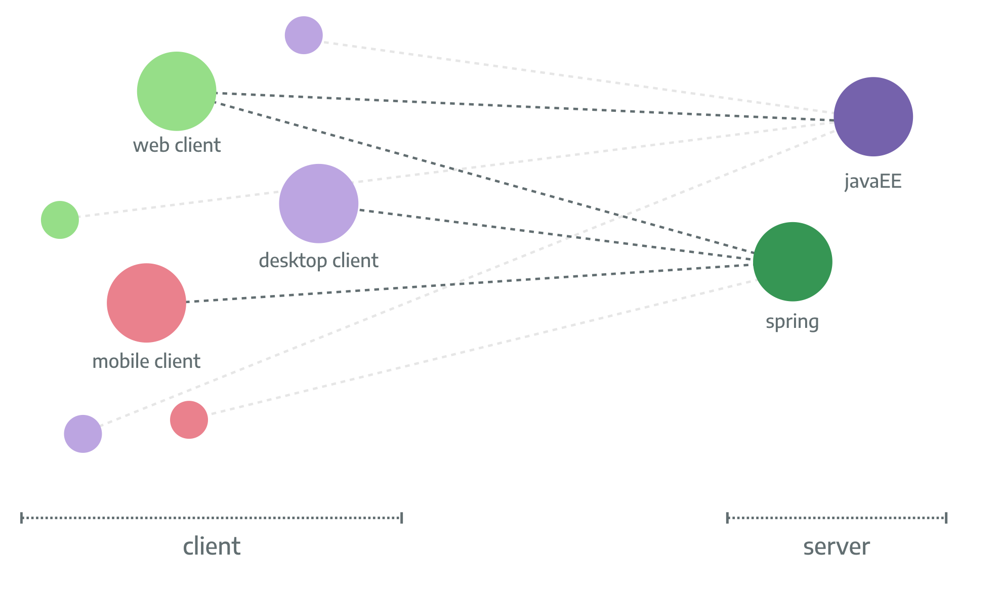

# Rico 
This repository contains all Java related sources of Rico. Clients for other languages will be provided in seperate repositories (JavaScript, AngularJS, Polymer and Android).

## About Rico
Rico is a client-server-framework that provides several functionalities and APIs to create enterprise applications. This
includes features like tracing pr monitoring that are critical in developing applications, escpecially in modern cloud based 
and distributed application landscapes.
To do so the Rico provides generic APIs with specific implementation for the mostly used frameworks
and toolkits in modern application development. 

Rico provides implementations for all its features for the given frameworks on the server:

* JavaEE / JakartaEE
* Spring (Boot)

Next to tis Rico provides implementations for the following ui toolkits and languages.

* Plain Java client
* JavaFX
* JavaScript client ([external repo](https://github.com/rico-project/rico-js))
* Polymer 2 client ([external repo](https://github.com/rico-project/rico-polymer))
* AngularJS (1.x) client ([external repo](https://github.com/rico-project/rico-angularjs))
* Angular (>2.x) client  ([external repo](https://github.com/rico-project/rico-angular))

## Features of Rico
As already mentioned Rico provides a list of general features that are usefull in mostly all enterprise applications. A
detailed description of the features will be part of the future technical documentation of Rico. Until now Rico provides
APIs for the following functionalities:

* client scope / session
* ui toolkit friendly http client
* application management
* general context manager
* metrics handling
* server timing
* security and sso
* remoting
* logging
* projection
* tracing

A general introduction of Rico can be found in the  ([Karakun DevHub](https://dev.karakun.com/rico/))

## Development origin
The Rico framework is the successor of the [Dolphin Platform](https://github.com/canoo/dolphin-platform) that provided 
functionality like an asynchronous remoting layer for enterprise applications based on generic APIs. While Rico shares 
the general idea of the Dolphin Platform it provides a lot more functionality.

## 🆕🐥🐶 First Timers Support
At Karakun we ❤️ open source. Based on this we develop the complete Rico framework as an open source project. If you are new to open source development we have some specific issues for you. Just have a look at all issues with the 'good first issue' label. This issues are reserved for people who never contributed to Open Source before. We know that the process of creating a pull request is the biggest barrier for new contributors. This issues are for you 💝 We use such issues for example to get involved at Hacktoberfest. If you want to know more about open source development and contribution in general you should have a look at this overview.

## License
The project is released as open source under the Apache License Version 2.0

